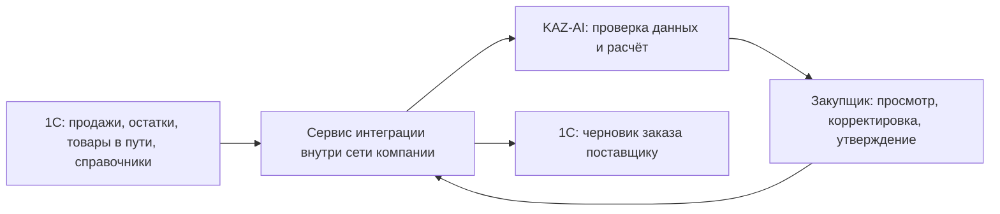

# Предлагаемое подключение KAZ-AI к 1С

**Статус: проект для HackAlem AI.** В текущем публичном демо используются только
синтетические товары и обезличенные ID клиентов. Подключения к 1С, доступа к базе
заказчика и реального API-ключа сейчас нет.

## Как будет работать обмен

1. Сервис интеграции читает из 1С только нужные данные: код товара, склад, период и
   количество продаж, обезличенный ID клиента, свободный остаток и его дату,
   поступления в пути с ETA, поставщика, кратность и подтверждённые условия закупки.
   Каждая загрузка получает ID среза и время; исходные документы остаются в 1С.
2. KAZ-AI проверяет полноту среза и рассчитывает рекомендации. Если остаток или
   обязательный параметр не подтверждён, количество заказа остаётся заблокированным.
3. Закупщик видит обоснование, меняет количество при необходимости и утверждает
   выбранные строки. Решение и исходная версия среза записываются в журнал.
4. Только после утверждения сервис интеграции создаёт **черновик** документа заказа
   в 1С. Уникальный ID утверждения используется для проверки дублей; после записи
   сервис повторно читает статус документа из 1С. Проведение и отправка поставщику
   остаются отдельным действием ответственного сотрудника.

## Технический вариант

Предпочтительный путь — опубликовать для нужной информационной базы стандартный
OData-интерфейс 1С и разрешить интеграционной учётной записи доступ только к
необходимым объектам. Платформа поддерживает чтение и создание объектов через
REST/OData; конкретные имена справочников, регистров и документов определяются
метаданными конфигурации заказчика. Если создание черновика требует бизнес-логики,
которой нет в стандартном OData, администратор 1С может предоставить отдельный
HTTP-сервис с узким контрактом. Это проектный выбор, а не утверждение, что такой
сервис уже существует. [REST-интерфейс 1С](https://kb.1ci.com/1C_Enterprise_Platform/1C_Enterprise_Platform_Overview/Integration/REST_interface/),
[публикация OData](https://kb.1ci.com/1C_Enterprise_Platform/FAQ/Development/Integration/Publishing_standard_REST_API_for_your_infobase/).

Интеграционный сервис лучше разместить в сети заказчика рядом с 1С. Публичный
статический сайт не обращается к 1С напрямую. Если расчётный сервер размещается
в облаке, передавать следует только согласованные обезличенные поля через
защищённый канал; архитектуру сети и разрешения должен согласовать заказчик.

## Нужен ли API-ключ

**Универсального обязательного ключа 1С нет.** Способ авторизации зависит от того,
как администратор опубликует базу: платформа документирует авторизацию HTTP через
`Basic` (учётная запись и пароль) и `Bearer` (токен доступа). Для собственного
HTTP-сервиса возможен отдельный согласованный механизм. Мы не выбираем его без
сведений о конфигурации заказчика. [Руководство администратора 1С](https://1c-dn.com/library/tutorials/1c_enterprise_administrator_guide_file_mode_8_3_27/).

Реквизиты подключения хранятся только в защищённых настройках серверного
интеграционного сервиса, передаются по HTTPS и не попадают в Git, JavaScript,
`localStorage` или CSV. Для чтения и записи можно выдать разные учётные записи
с минимальными правами. Права самого закупщика в KAZ-AI и доступ сервиса к 1С —
разные уровни авторизации.

## Что понадобится для промышленного пилота

- Тестовая база и версия платформы/конфигурации 1С; опубликованный OData или
  согласованный HTTP-сервис и перечень доступных объектов.
- Схема полей: соответствие кода товара и ссылки 1С, склад, единица измерения,
  поставщик, дата остатка, статусы документов, правила проведения заказа.
- Подтверждённые сроки поставки, страховой запас, MOQ, обезличенные ID клиентов и
  периоды отсутствия товара. Без этих данных KAZ-AI не выпускает реальный заказ.
- Тестовая учётная запись или токен с минимальными правами; секрет передаётся
  администратором только при пилоте, не для конкурсного демо.
- Проверка чтения одного среза, расчёта, ручного утверждения, создания одного
  черновика, повторного запроса без дубля и чтения статуса из 1С.

До пилота остаётся доступен безопасный альтернативный путь: ручной CSV-экспорт
утверждённых синтетических заказов. Текущий формат CSV не заявлен как готовый
формат импорта конкретной 1С заказчика.
